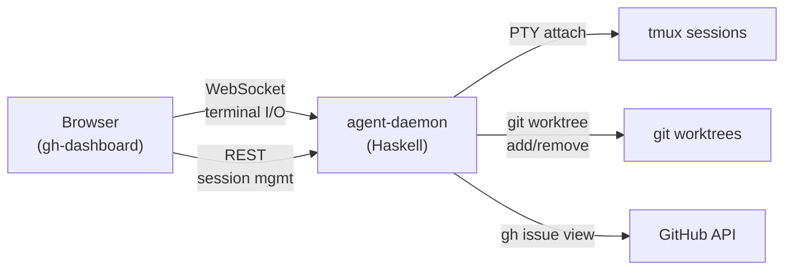
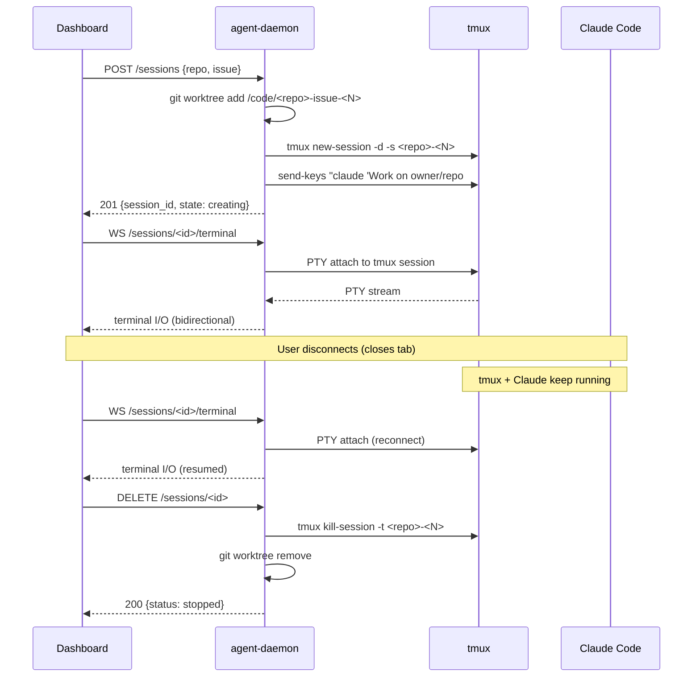
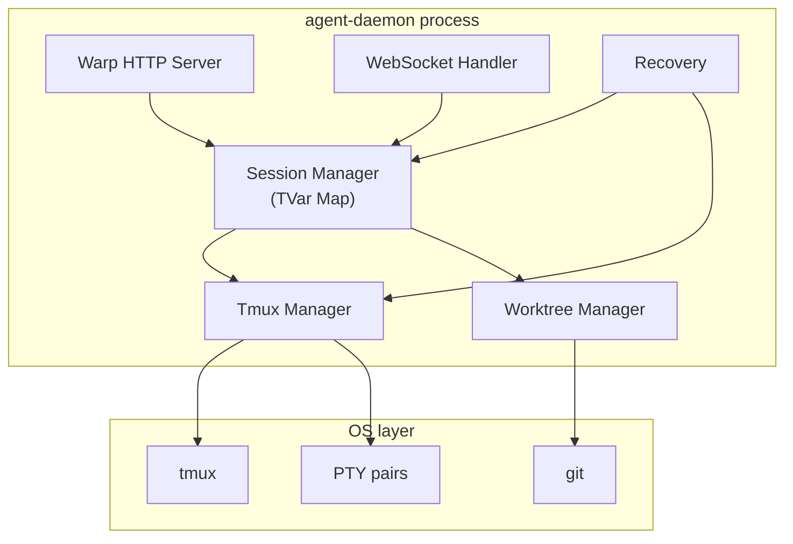
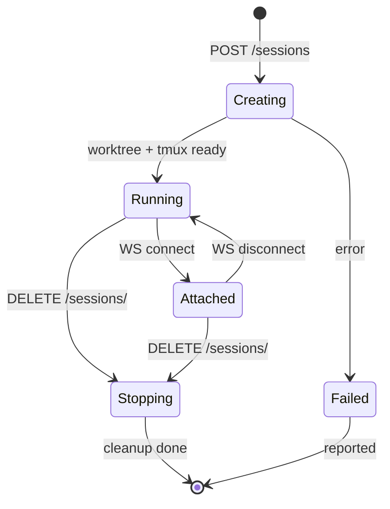
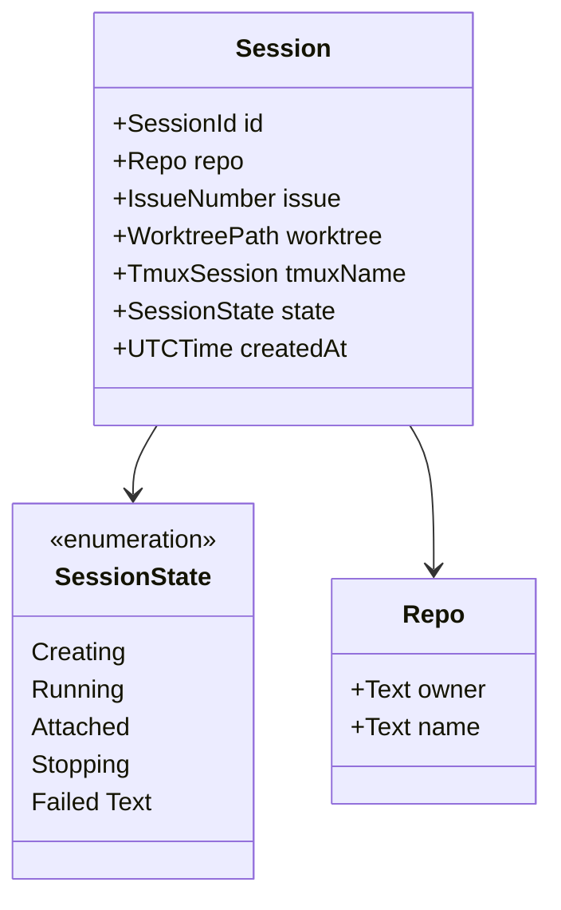
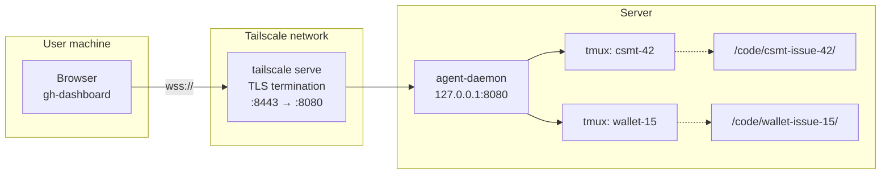

# tmux-ws design

> Historical architecture diagrams below retain `agent-daemon` labels for
> context. They are not current installation, service, or command guidance;
> operators use `tmux-ws` as documented in the deployment and release guides.

## Overview

A Haskell WebSocket server that manages Claude Code agent sessions.
Runs on a single machine reachable via Tailscale, providing full
terminal access to tmux sessions through xterm.js in the browser.

## System Context



## Session Lifecycle



## Component Architecture



### Components

- **Warp HTTP Server** — REST endpoints for session CRUD, static file serving
- **WebSocket Handler** — bridges xterm.js to tmux PTY streams with bidirectional binary frames
- **Session Manager** — in-memory `TVar (Map SessionId Session)`, thread-safe, not persisted to disk
- **Tmux Manager** — creates, attaches, kills tmux sessions
- **Worktree Manager** — creates and removes git worktrees, branches as `feat/issue-<N>`
- **Recovery** — on startup, scans for existing tmux sessions and reconstructs state from worktree directories and git remote URLs

## Session State Machine



## Data Model



## Naming Conventions

| Entity | Pattern | Example |
|--------|---------|---------|
| Worktree path | `/code/<repo>-issue-<N>/` | `/code/cardano-utxo-csmt-issue-42/` |
| tmux session | `<repo>-<N>` | `cardano-utxo-csmt-42` |
| Branch | `feat/issue-<N>` | `feat/issue-42` |
| Session ID | `<repo>-<N>` | `cardano-utxo-csmt-42` |

## REST API

### Launch session

```
POST /sessions
Content-Type: application/json

{
  "repo": { "owner": "cardano-foundation", "name": "cardano-utxo-csmt" },
  "issue": 42
}

→ 201 Created (new session)
→ 200 OK (session already exists, idempotent)
{
  "id": "cardano-utxo-csmt-42",
  "repo": { "owner": "cardano-foundation", "name": "cardano-utxo-csmt" },
  "issue": 42,
  "worktree": "/code/cardano-utxo-csmt-issue-42",
  "tmuxName": "cardano-utxo-csmt-42",
  "state": "creating",
  "createdAt": "2026-03-13T10:30:00Z"
}
```

### List sessions

```
GET /sessions

→ 200 OK
[
  {
    "id": "cardano-utxo-csmt-42",
    "repo": { "owner": "cardano-foundation", "name": "cardano-utxo-csmt" },
    "issue": 42,
    "state": "running",
    "createdAt": "2026-03-13T10:30:00Z"
  }
]
```

### Stop session

```
DELETE /sessions/cardano-utxo-csmt-42

→ 200 OK
{ "status": "stopped" }
```

Kills the tmux session and removes the git worktree.

### Terminal attach

```
GET /sessions/cardano-utxo-csmt-42/terminal
Upgrade: websocket

↔ bidirectional binary frames (terminal I/O)
```

Terminal resize is sent as a protocol message: `\x01cols;rows`.

### Static files

tmux-ws serves the browser SPA from `--static-dir` on the same origin as the
REST and WebSocket API. Any path not matching the API routes serves static
assets first, then falls back to `index.html` for SPA routing.

### CORS

All responses include permissive CORS headers (any origin, GET/POST/DELETE/OPTIONS).

## Issue Context Injection

When a session launches, the daemon sends a bootstrap command to tmux:

```bash
claude 'Work on owner/repo#N. Start by running: gh issue view N -R owner/repo'
```

Claude receives the issue context by running `gh issue view` interactively.
No environment variables or prompt files are used.

## Session Recovery

On startup the daemon reconstructs state from existing tmux sessions:

1. Run `tmux list-sessions` to find active sessions
2. Parse session names (split on last hyphen: `repo-name-N` → repo=`repo-name`, issue=`N`)
3. Check for worktree directory at `baseDir/repoName-issue-N`
4. Read git remote URL from the worktree to recover `repoOwner`
5. Create `Session` records with `Running` state in the in-memory map

This means the daemon can be restarted without losing track of running
agent sessions — tmux and worktrees are the persistent state.

## Network Topology



The daemon binds to `127.0.0.1` (localhost only). `tailscale serve`
provides TLS termination on port 8443, accessible only within the
tailnet. See README.md for setup instructions.

## Authentication

Currently relies on Tailscale ACLs — only machines on the tailnet can
reach the service. No application-level authentication (tokens, API keys).

## Current Limitations

- **No resource limits** — unbounded concurrent sessions, no memory or CPU guards
- **No completion detection** — sessions run until explicitly stopped; no webhook or polling for PR creation
- **In-memory state** — session metadata is not persisted to disk (recovered from tmux on restart)
- **Single WebSocket per session** — no multi-attach tracking
